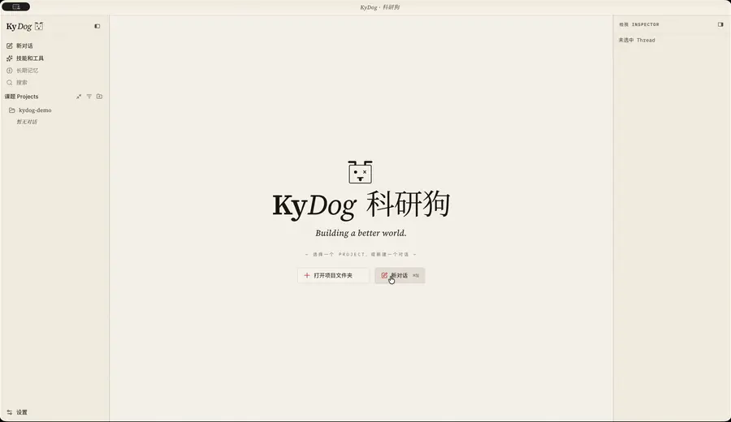

<p align="center">
  
</p>

<h1 align="center">KyDog</h1>

<p align="center">An AI agent desktop app built for the research workflow</p>

<p align="center">
  <a href="https://github.com/zhangyee/kydog/stargazers"></a>
  <a href="https://github.com/zhangyee/kydog/releases"></a>
  <a href="LICENSE"></a>
  
</p>

<p align="center">
  <a href="README.md">中文</a> · <b>English</b>
</p>

---

## Demo



## What KyDog is

Bolting a pile of literature MCPs onto a general-purpose coding agent — Codex, Claude Code — is a road many researchers have tried. But coding agents are built for writing code and shipping projects; their conversations and tool calls are oriented toward producing a result, which is a poor fit for reading a paper and chasing down a new idea the moment it surfaces. Research, meanwhile, is mostly searching, close reading, cross-checking, and writing. So I built what my own daily work needed: a harness and agent shell rebuilt around academic literature.

KyDog pairs a CLI that searches, downloads, and reads across 23 academic and scientific literature sources with workflow skills spanning four stages — research, study, write, review — turning literature work into a pipeline you can audit. One slash command states what you want; the agent searches multiple sources in parallel, traces classics back through citation chains, and verifies every paper against its source, downloading everything the report touches into the project's `papers/` directory. Those PDFs open directly inside the app, with no detour to another reader, and the reports the skills produce — topic assessments, reviews, fact-checks — all come out as Markdown, read and edited in a built-in WYSIWYG editor. Searching, reading, writing, and revising happen in one window.

So that the agent remembers across sessions who you are, what you're researching, and how you like to write — instead of you re-explaining from scratch in every new conversation — KyDog borrows Openclaw's workspace architecture: three files, `AGENTS.md`, `SOUL.md`, and `USER.md`, carry the system prompt and give the agent the persona of a research collaborator. Edit them by hand to shape a research assistant of your own.

## What can KyDog do?

- **23 literature sources, searched in parallel by one fastpaper command** — arXiv, PubMed, PMC, Europe PMC, bioRxiv, medRxiv, OSF Preprints, Semantic Scholar, OpenAlex, Crossref, DataCite, DBLP, CORE, OpenAIRE, DOAJ, HAL, Zenodo, Unpaywall, INSPIRE-HEP, zbMATH Open, ERIC, OSTI.GOV, NASA NTRS<sup>[note 1]</sup>. The CLI ships with the app; nothing else to install.
- **Citations and claims are verifiable — the harness holds the model to its sources** — every DOI confirmed against the source, every claim traced back to the original text, and every paper the report touches downloaded automatically into `papers/`.
- **A complete research pipeline** — skills covering four stages, research → study → write → review, invoked by slash command. More are being worked on.
- **Broad coverage of the major models** — 20 built-in LLM providers, plus any OpenAI-compatible endpoint (local Ollama / vLLM / your own proxy). Subscription sign-in for Claude Pro/Max, ChatGPT (Codex), and GitHub Copilot; API keys for Anthropic, OpenAI, DeepSeek, Google Gemini, OpenRouter, Mistral, Groq, Cerebras, xAI, ZAI, Kimi, MiniMax and more; cloud access via Azure OpenAI, Amazon Bedrock, Google Vertex AI.
- **PDFs and Markdown, read and edited in place** — a built-in PDF reader and a WYSIWYG Markdown editor, so you stop shuffling between applications.
- **Local-first** — a project is just a directory on your own disk; retrieved papers and generated reports are written there. Sessions and settings live in `~/.kydog/`, with credential files forced to `0600`. No cloud account, and none of your content is uploaded.

> **[note 1]** Google Scholar and Baidu Xueshu were dropped from the source list in v0.3.1: both platforms have tightened API access and neither is reachable. I plan to reach them, and more sources, through in-app browsing instead. If you'd like to see that sooner, [sponsoring the project](#supporting-the-project) helps.

## Built-in skills

KyDog's skills are organized around one complete research workflow:

```
research (scope & survey)  →  study (self-teaching)  →  write (drafting support)  →  review (self-check & verification)
```

### The one thing every output shares: citations that hold up

This is the most substantive difference between KyDog and asking a general-purpose agent to find you some papers. The four rules below aren't suggestions — they're hard constraints written into every skill:

- **Never invent an id.** Every DOI / arXiv id / PMID that makes it into an output must be confirmed against the source — if it can't be retrieved, that line doesn't get written. The prose gets pasted straight into a paper; one fabricated DOI is an academic incident.
- **Claims must point back to the source text.** Every number, effect size, and direction of conclusion is located in a specific section before it's written down. Evidence that can't be checked against the original doesn't make it in, and "what the literature says" is kept distinct from "what I inferred."
- **State the verification level honestly.** Full text read, abstract only, or not obtained — recorded as three separate tiers in the appendix. Anything that couldn't be done is written down as not done, never faked.
- **Every paper involved is downloaded to `papers/`.** What you get isn't just a document — it's a document plus the PDFs sitting in your project directory. You can always go check for yourself instead of trusting a paraphrase.

### Research · scope & survey — settle what to work on, and map where the field already stands

| Command | What it answers | What it does beyond just asking | Output |
|---|---|---|---|
| `/research-ideation` | Topic assessment: is my idea worth doing, and has it been done? | Forces out answers to the nine Heilmeier questions, then builds a six-bin literature map with every entry verified against its source | An assessment — worth doing / needs narrowing / consider another direction — plus a set of adjacent topics and the PDFs in `papers/` |
| `/literature-review` | Literature review: what is this field, and how far has it gotten? | Multi-round, multi-keyword, cross-source search; surveys first, then classics traced back through citation chains; separates foundational work, mainstream approaches, consensus and controversy, and recent progress, and states how it differs from existing surveys | One Markdown file: the front half is Related Work prose ready to paste into a paper (author-year citations plus a reference list), the back half is the search funnel, literature map, and verification report |
| `/research-frontier` | Frontier briefing: what might I have missed this past year? | Looks only at the last twelve months: who is going deep, along what trajectory, which assumptions have been shaken, what new terminology appeared, what's still contested | A 1,500–2,500 word briefing written for insiders — no background, no consensus map, every judgment traceable to a specific paper |

### Study · self-teaching — build up the background you're missing

| Command | What it answers | What it does beyond just asking | Output |
|---|---|---|---|
| `/learning-deck` | Study report: how does this concept or method actually work? | Three rounds of interview go through the concepts one at a time, asking how well you know each, to find out which prerequisites for the target concept you're actually missing — only those get written up; searches surveys, tutorials, and foundational papers rather than the latest work; figures embed the paper's own wherever they can be retrieved, are otherwise redrawn as inline SVG after reading the original, and data plots are never redrawn — every figure is labelled as original, redrawn from, or the report's own | A self-contained HTML study report you can open offline — knowledge map, one section per concept (definition → what problem it solves → mechanism diagram → common misconceptions and boundaries → sources), method comparison table, terminology glossary, and a close-reading list |

### Write · drafting support — produce text that goes straight into the paper

| Command | What it answers | What it does beyond just asking | Output |
|---|---|---|---|
| `/paper-summary` | Paper write-up: how do I write this paper into my own? | Asks which job you're doing first — placing it in related work, contrasting it with yours, borrowing or reproducing its method, or using its limitations to justify your work. The same paper calls for completely different prose depending on the purpose | The paragraph itself, delivered in the conversation with no file written — you want to select and copy |

### Review · self-check & verification — check every claim before it goes out

| Command | What it answers | What it does beyond just asking | Output |
|---|---|---|---|
| `/peer-review` | Review self-check: what will referees hit in this manuscript before I submit? | Runs a simulated review under the review kernel: the whole first — tracing the argument chain link by link, pinning the claimed contribution against search-confirmed closest prior work (the novelty's layer, a falsifiable delta, its weight for the target venue), and talking direction with you before details when something fatal turns up; then triages item by item, confirming with you the dispositions (revise / defer / reject) that are yours to call; real reviewer comments can be fed in directly | A revision plan — overall judgment plus per-comment blocks (severity, disposition, location and "change to"), with every cited reference verified at the source |
| `/peer-review-response` | Peer review: invited to referee — how to write a formal report the authors can check? | Neutral mapping first pins down what the manuscript says, then the whole, then item by item; every concern carries a location, the problem, why it matters, and how to fix it; literature judgments — "already done / missing work / citation doesn't support the claim" — are written only after search or source verification; a tier with nothing gets "none identified", no padding | A submission-ready review report — overall judgment, Major / Minor, could-not-assess items, the review's own limitations, and the references it cites |
| `/fact-check` | Evidence check: is there evidence for this claim? | Decomposes the claim into decidable sub-propositions and confirms the decomposition with you; searches for supporting *and* contradicting evidence (looking only for support is confirmation bias); grades evidence strength by study design and sample size, **never by journal prestige**; checks every paper used as evidence for retraction (only where PubMed / PMC reach — anything outside is recorded as unchecked) | A five-level verdict (holds / holds conditionally / insufficient evidence / contradicting evidence / does not hold), the boundary within which it holds, and an 800–1,200 word report. Every verdict carries a boundary — one without a boundary is almost certainly wrong |

## Installation

Download the installer for your platform from [Releases](https://github.com/zhangyee/kydog/releases). macOS (Apple Silicon / Intel) and Windows x64 are currently provided.

### First launch on macOS

The MVP is not yet Apple-signed or notarized, so Gatekeeper blocks the first launch:

1. System Settings → Privacy & Security
2. Scroll to the bottom and click **Open Anyway** under "KyDog was blocked"

If it still won't launch (occasionally on macOS 15.1+), run this once in a terminal:

```bash
xattr -d com.apple.quarantine /Applications/KyDog.app
```

### First launch on Windows

1. Double-click the `.exe`. SmartScreen will warn you → click **More info** → **Run anyway**
2. KyDog's shell tooling needs [Git for Windows](https://git-scm.com/download/win). If it isn't installed, KyDog prompts you on first launch — install Git, then restart KyDog

### Building from source

Requires Node.js ≥ 22.12:

```bash
git clone https://github.com/zhangyee/kydog.git
cd kydog
npm install
npm start
```

See [CONTRIBUTING.md](CONTRIBUTING.md) for the rest.

## TODO

What KyDog does today is less than a third of the full idea. These are already on my development plan:

- [ ] **More skills** — extending along research → study → write → review. Today research has three, study one, review three; the write stage is still thin.
- [x] ~~**PDF annotation** — highlighting and notes, plus Chinese translation and side-by-side bilingual reading.~~
- [ ] **Follow-up questions and citation commentary on documents** — ask about a selected passage right inside the Markdown editor, and get commentary on the references it cites.
- [ ] **slowpaper: in-app browsing** — let the agent drive a browser inside the app, supporting CARSI (the Chinese education and research network's federated identity service) sign-in and reaching more literature sources that require browser interaction.
- [ ] **A LaTeX editor** — an editing and compilation experience along the lines of Overleaf.

Feature requests and feedback are welcome in [Issues](https://github.com/zhangyee/kydog/issues). [Sponsoring the project](#supporting-the-project) helps speed all of this up.

## Acknowledgements

KyDog stands on the shoulders of these projects.

**Architectural core**

- **[Pi](https://github.com/earendil-works/pi)** — Mario Zechner. KyDog's agent loop is built directly on `pi-coding-agent`: LLM provider integration and credential management, the model catalogue, tool registration and execution, context management, and session persistence all come from it. On top of that, KyDog adds only its own tools (asking the user a question, reading figures out of a PDF, reading Word documents directly), skill loading and locale projection, and the desktop event plumbing.
- **[Electron](https://github.com/electron/electron)** — the desktop shell. The main process runs Node and handles agent sessions, file I/O, and CLI invocation; the renderer runs Chromium and handles the UI, the PDF reader, and the Markdown editor; the two talk only over the RPC and event channels funnelled through `src/shared/protocol.ts`. Cross-platform packaging goes through electron-forge, and updates through Electron's `autoUpdater` against update.electronjs.org.

**Inspiration**

- **[Openclaw](https://github.com/openclaw/openclaw)** — Peter Steinberger. It puts agent configuration out in the open: not behind a GUI or a proprietary format, but as a handful of readable, editable, version-controllable markdown files in the workspace directory. KyDog takes three of them — `SOUL.md` for personality and tone, `AGENTS.md` for working procedure, `USER.md` for who you are and what you're researching — to assemble the system prompt, which is also what lets you customize your own assistant by editing files.
- **[Open Scholar Skill](https://github.com/joshzyj/open-scholar-skill)** — Prof. Yongjun Zhang. A Claude Code skill suite for social scientists writing for top-tier journals: 35 skills decompose the whole chain — ideation, literature synthesis, hypotheses, research design, analysis, writing, submission, responding to reviewers — stage by stage, with mandatory human checkpoints at the critical ones. It showed me how finely a research workflow can be sliced into skills; KyDog's research skills owe it both their granularity and their habit of asking before acting. The comment triage in the two review skills — dispositions first, your confirmation before any writing — and the no-extras rule for revision rounds also come from its scholar-respond.
- **[Academic Research Skills for Claude Code](https://github.com/Imbad0202/academic-research-skills)** — Edward Cheng-I Wu. Four skills forming a research → write → review → revise → finalize pipeline that keeps a human decision point at every stage instead of chasing full automation, with citation verification and claim-to-source alignment as their own audit passes. KyDog's four-stage split, and its hard rule that every citation must be verified against its source, both found corroboration here.
- **[Claude Academic Research](https://github.com/mronkko/claude-academic-research)** — Mikko Rönkkö. Its critic-loop grounds "when is the revision done" in checkable bookkeeping: every comment must have a recorded fate, and rejecting a Major has exactly two exits — a verifiable refutation, or the author explicitly ruling it out of scope. The disposition discipline in KyDog's review skills comes straight from here.
- **[Research Skills](https://github.com/neuromechanist/research-skills)** — Seyed Yahya Shirazi. Its paper-review pins every review comment into five elements — location, problem, why it matters, suggestion, basis — with severity criteria spelled out verbatim, no hedging. KyDog's review kernel takes its comment structure and severity tiers from it.
## Contributing

KyDog is developed and maintained by one person and badly needs feedback from real research work.

- **Feature requests and bug reports** → [Issues](https://github.com/zhangyee/kydog/issues). Reports of the form "this skill doesn't work well in my field" are especially welcome — far more useful than feature wishes.
- **Code** → the development environment, directory layout, verification commands, and conventions are in [CONTRIBUTING.md](CONTRIBUTING.md). Issues and pull requests in English are welcome.

## License and privacy

Licensed under [GPL-3.0-or-later](LICENSE).

KyDog participates in anonymous usage statistics by default (a random install identifier plus app version, OS, and CPU architecture, at most once a day). It **does not send** file contents, conversation contents, project paths, filenames, or any personal information. You can opt out on the last page of first-run setup, and turn it off and delete collected data at any time under Settings → About → Privacy. Full details (in Chinese): [src/about/privacy.md](src/about/privacy.md). The server code is open for inspection: [kydog-telemetry](https://github.com/zhangyee/kydog-telemetry).

## Supporting the project

If KyDog saves you time, or you believe in where it's headed, a star helps — it's the most direct signal I have for deciding where to put my effort.

Sponsorship is welcome too. The QR code is a WeChat one, so it's only usable inside China — see [支持这个项目](README.md#支持这个项目) in the Chinese README.

<!-- No star history chart: since 2026-06-30 GitHub limits the stargazers API to a repo's own
     admins and collaborators, so any third-party chart service needs a token with contents
     WRITE access (GitHub uses write to verify collaborator status; read-only is rejected).
     Not worth it. The badge at the top gives the current count. Revisit if an approach
     appears that doesn't require handing out write access. -->
