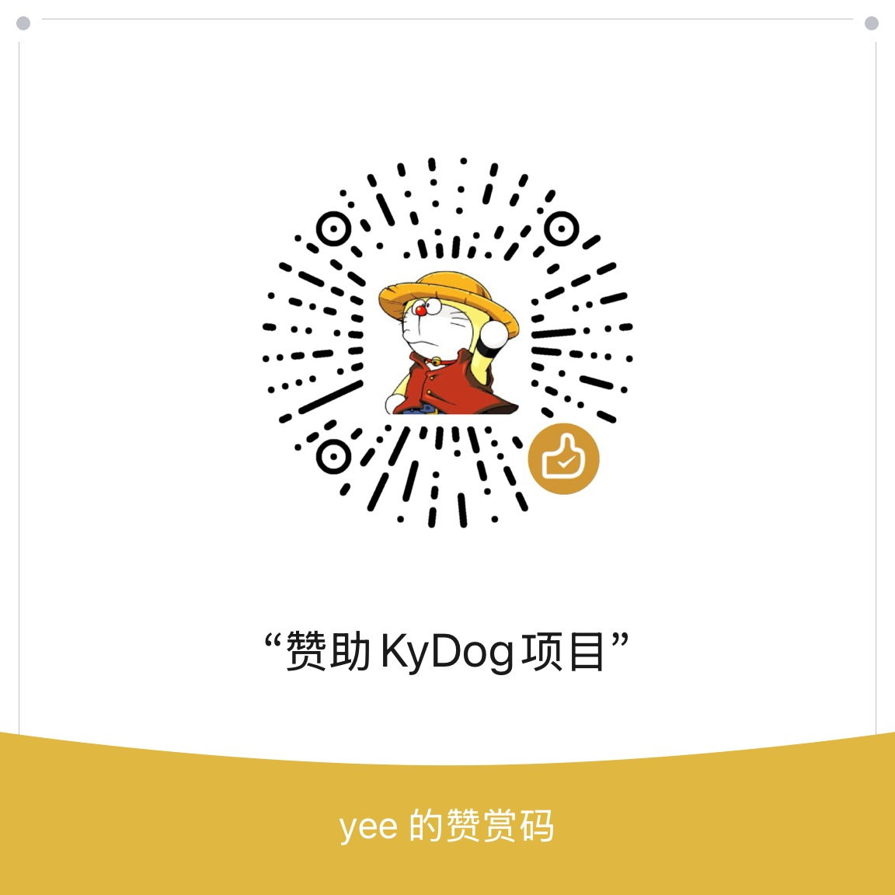

<p align="center">
  
</p>

<h1 align="center">KyDog 科研狗</h1>

<p align="center">—— 面向科研工作流的 AI 智能体桌面应用</p>

<p align="center">
  <a href="https://github.com/zhangyee/kydog/stargazers"></a>
  <a href="https://github.com/zhangyee/kydog/releases"></a>
  <a href="LICENSE"></a>
  
</p>

<p align="center">
  <b>中文</b> · <a href="README.en.md">English</a>
</p>

---

## 演示


## KyDog 是什么

在 Codex 或 Claude Code 等通用编程智能体里装一堆文献 MCP，是很多研究者都尝试过的路。但编程智能体的使用场景是代码生成与项目开发，对话和工具调用都以生成结果为导向，并不适合一边查阅论文，一边验证突然涌现出来的新想法。而科研的日常恰恰是大量的检索、精读、核对与写作。于是，我根据自己日常使用的需求，开发了一套按学术文献场景重做的 harness 与智能体外壳。

KyDog 用覆盖 23 个学术与科技文献来源的检索、下载与阅读 CLI，加上能在应用内置浏览器里访问 Google Scholar、百度学术等无 API 学术源的 slowpaper，配上面向「研究 — 学习 — 写作 — 评审」四阶段的工作流 skill，把查文献这件事做成一条可复核的流水线：一条斜杠命令说清你要什么，智能体便多源并行检索、沿引用链反查经典、逐篇回源核验，报告里涉及的论文全部自动下载到项目的 `papers/` 目录 —— 论文 PDF 可直接在应用内打开，不必切去别的阅读器；选题、综述、事实核查等各种 skill 形成的报告，都以 Markdown 格式呈现，内置 WYSIWYG 所见即所得式的 Markdown 阅览和编辑交互，查、读、写、改都在同一个窗口里完成。

为了让智能体跨会话记得你是谁、在研究什么、习惯怎么写 —— 而不是每开一个新对话都从零解释一遍 —— KyDog 借鉴了 Openclaw 的工作区架构，用 `AGENTS.md` / `SOUL.md` / `USER.md` 三个文件承载系统提示词，并给智能体一个科研协作者人格。您可以手动修改这些文件，从而自定义出自己独特的科研助手。

## KyDog 能干什么？

- **23 个文献源，一条 fastpaper 命令并行检索** —— arXiv、PubMed、PMC、Europe PMC、bioRxiv、medRxiv、OSF Preprints、Semantic Scholar、OpenAlex、Crossref、DataCite、DBLP、CORE、OpenAIRE、DOAJ、HAL、Zenodo、Unpaywall、INSPIRE-HEP、zbMATH Open、ERIC、OSTI.GOV、NASA NTRS<sup>[注 1]</sup>。CLI 随应用打包，不用另装。
- **slowpaper：智能体在内置浏览器里查没有 API 的源** —— Google Scholar、百度学术两个学术搜索引擎，加上 MDPI、Frontiers、PeerJ、ChemRxiv、SSRN、AGRIS、PubScholar、ChinaXiv、国家哲学社会科学文献中心九个 OA 全文源。中文期刊与学位论文、跨库查全、国内外对照，都由它补上 fastpaper 够不着的那一块。它在浏览器侧栏里的每一步你都看得见，遇到验证码会停下来请你点一下。两套工具各自支持哪些源，见 [文献源说明](docs/literature-sources.md)。
- **引文与论断可核验，通过 harness 严格控制 LLM 幻想作答** —— 每个 DOI 回源确认、每条论断指回原文，报告涉及的论文全部自动下载到 `papers/`。
- **一条完整的研究工作流管线** —— 面向「研究 — 学习 — 写作 — 评审」四阶段的 skill，斜杠命令直接调用。更多 skill 正在打磨，敬请期待。
- **主流大模型接入全覆盖** —— 20 个内置 LLM provider，以及任意 OpenAI 兼容端点（本地 Ollama / vLLM / 自有代理）。Claude Pro/Max 与 ChatGPT (Codex)、GitHub Copilot 订阅登录；Anthropic、OpenAI、DeepSeek、Google Gemini、OpenRouter、Mistral、Groq、Cerebras、xAI、ZAI、Kimi、MiniMax 等 API Key 接入；Azure OpenAI、Amazon Bedrock、Google Vertex AI 云接入。
- **PDF 与 Markdown 就地读写** —— 内置 PDF 阅读器和所见即所得 Markdown 编辑器，不用在不同应用程序之间来回倒腾。
- **本地优先** —— 项目就是你自己磁盘上的一个目录，检索到的论文和产出的报告都写在那里；会话与设置存在 `~/.kydog/`，凭据文件权限强制 `0600`。没有云端账号，不上传你的内容。

> **[注 1]** Google Scholar、百度学术因平台收紧 API 访问，自 v0.3.1 起从 fastpaper 的来源列表中移除，现在改由 slowpaper 在内置浏览器里访问（见上面 slowpaper 那一条）。

## 内置 skill

KyDog 的 skill 按一条完整的研究工作流组织：

```
research 选题与研究  →  study 科研自学  →  write 论文写作辅助  →  review 评审自查与核验
```

### 所有产物共享的一件事：引文经得起查

这是 KyDog 和「让通用智能体帮我查文献」最实质的区别。以下四条不是建议，是写进每个 skill 的硬约束：

- **一个 id 都不许编。** 写进产物的每个 DOI / arXiv id / PMID，都必须回源确认过 —— 拿不到就不写那一条。正文会被原样抄进论文，一个假 DOI 就是一次学术事故。
- **论断要能指回原文。** 每个数字、效应量、结论方向都定位到具体章节再落笔；核不到原文的证据不进产物，「文献说的」和「我的推断」必须分开标。
- **核验层级如实标注。** 读过全文的、只看了摘要的、没拿到的，在附录里分三档写清楚 —— 做不到的那一项就写明没做，不假装做过。
- **涉及的论文自动下载到 `papers/`。** 交付的不只是一份文本，还有一整套可复核的 PDF 就躺在项目目录里。你可以随时自己回去对，不必信转述。

### Research 选题与研究 — 定下做什么，并摸清这个方向已经做到哪一步

| 命令 | 它回答什么 | 它比直接问多做的事 | 产物 |
|---|---|---|---|
| `/research-ideation` | 科研选题：我这个想法值不值得做，有没有人做过？ | 用 Heilmeier 九问逼出选题的九个答案，再把文献搜成六箱图谱逐条回源核验 | 评估报告 —— 值得做 / 需要收窄 / 建议换方向，附一批延伸选题 + `papers/` 里的 PDF |
| `/literature-review` | 论文综述：这个方向是什么，现在做到哪一步了？ | 多轮、多关键词、跨源检索；先找综述再沿引用链反查经典；分清奠基工作、主流路线、共识与争议、最新进展，并说清自己和已有综述的差别 | 一份 Markdown：前半是可直接粘进论文的「研究现状 / Related Work」（作者年份引用 + 参考文献列表），后半是检索漏斗、文献图谱与核验报告 |
| `/research-frontier` | 前沿进展：这一年里我可能错过了什么？ | 只查最近一年：谁在持续深耕、沿什么轨迹演进、哪些既有假设被动摇、领域长出了什么新术语、还在争什么 | 1500–2500 字前沿简报，默认读者是内行 —— 不讲背景、不建共识地图，每条判断都指得到具体文献 |

### Study 科研自学 — 把陌生的概念与方法补成自己的底子

| 命令 | 它回答什么 | 它比直接问多做的事 | 产物 |
|---|---|---|---|
| `/learning-deck` | 自学报告：这个概念 / 方法到底是怎么回事？ | 三轮访谈逐个知识点问你的掌握程度，摸清「讲清这个概念所需要的前序概念，你缺哪几个」，只写你缺的那几节；检索综述、tutorial 与奠基论文而非最新进展；图优先内嵌原文插图，取不到的才看懂原文后重画成内联 SVG，散点热图这类数据图一律不重画，每张图都注明是原图、改画自哪一张还是自画 | 可离线打开的 HTML 自学报告 —— 知识地图、每个知识点一节（定义 → 解决什么问题 → 机制图 → 常见误解与边界 → 出处）、方法对比表、术语对照、精读清单 |

### Write 论文写作辅助 — 产出能直接落进论文的文字

| 命令 | 它回答什么 | 它比直接问多做的事 | 产物 |
|---|---|---|---|
| `/paper-summary` | 论文总结：这篇论文我该怎么写进自己的论文？ | 先问你这次要干哪个活 —— 写进相关工作、写与它的对比、借鉴或复现它的方法、用它的局限论证自己工作的必要性。同一篇论文，用途不同，该写出的文字完全不同 | 就在对话里给出那一段话，不落文件 —— 你要的就是选中复制 |

### Review 评审自查与核验 — 写出去之前，先把每句话自己核一遍

| 命令 | 它回答什么 | 它比直接问多做的事 | 产物 |
|---|---|---|---|
| `/peer-review` | 评审自查：这稿子投出去之前，还有什么会被审稿人打？ | 按评审内核跑一轮模拟评审：先判全局——论证链逐环追、贡献定位用检索钉出最接近的前置工作（新意的层次、可证伪的差量、对目标场合的分量），大方向有问题先跟你谈方向再谈细节；随后逐条分诊，该你拍板的处置（改 / 挂起 / 拒绝）问你确认；收到的真实审稿意见也能直接喂进来 | 修改方案报告 —— 全局判断 + 逐条评审意见（严重度、处置、位置与「改成什么」）+ 引用文献，全部回源核验 |
| `/peer-review-response` | 同行评审：受邀审稿，怎么写出经得起作者反查的正式意见？ | 先中性映射钉住稿子说了什么，再判整体、后逐条；每条意见带位置、问题、为何重要、怎么改；「已有人做过 / 漏引 / 引文不支持」这类文献判断全部检索回源后才写；没有意见就写「未发现」，不凑数 | 可直接提交的评审报告 —— 总体判断、Major / Minor、未能评估项、本评审的局限、评审引用的文献 |
| `/fact-check` | 论据核验：这个说法有证据支持吗？ | 先把断言拆成可判定的子命题并跟你确认拆法；正反两路都找证据（只找支持证据是确认偏误）；按研究设计和样本分层评估证据强度，**不看期刊名气**；每篇当证据用的论文都反查是否被撤稿（限 PubMed / PMC 覆盖的领域，覆盖不到的如实写明没查） | 五档判定（成立 / 有条件成立 / 证据不足 / 有反证 / 不成立）+ 成立的边界 + 800–1200 字核查报告。判定必须带边界 —— 不带边界的学术判定基本一定是错的 |

## 安装

到 [Releases](https://github.com/zhangyee/kydog/releases) 下载对应平台的安装包。目前提供 macOS（Apple Silicon / Intel）与 Windows x64。

### macOS 首次启动

MVP 阶段还没有 Apple 签名与公证，Gatekeeper 会拦下第一次启动：

1. 系统设置 → 隐私与安全性
2. 拉到底部，在「已阻止 KyDog」处点 **仍要打开**

如果仍打不开（macOS 15.1+ 偶发），在终端跑一次：

```bash
xattr -d com.apple.quarantine /Applications/KyDog.app
```

### Windows 首次启动

1. 双击 `.exe`，SmartScreen 会警告 → 点 **更多信息** → **仍要运行**
2. KyDog 的 shell 工具依赖 [Git for Windows](https://git-scm.com/download/win)。没装的话首次启动会提示，装完重启 KyDog 即可
3. 手动安装新版之前，先完全退出 KyDog。安装卡在解压画面、关掉重装也不行，或者装好后打不开，见 [Windows 安装排错](docs/windows-install-troubleshooting.md)

### 从源码构建

需要 Node.js ≥ 22.12：

```bash
git clone https://github.com/zhangyee/kydog.git
cd kydog
npm install
npm start
```

更多开发相关内容见 [CONTRIBUTING.md](CONTRIBUTING.md)。

## TODO 计划

KyDog 现在能做的，离完整构想还不到三分之一。下面这些功能，已列入了我的开发计划：

- [ ] **补齐 skill** —— 沿「研究 — 学习 — 写作 — 评审」往后做。目前研究阶段有三个、学习阶段一个、评审阶段三个，写作段还很薄。
- [x] ~~**PDF 标注** —— 划线批注，中文翻译与双语对照阅读。~~
- [ ] **文档追问与引文评述** —— 在 Markdown 编辑器里就地对选中段落追问，并对它引用的文献给出评述。
- [x] ~~**slowpaper：in-app browsing** —— 让智能体在应用内操作浏览器，接入更多必须经浏览器才能访问的学术文献源。~~
- [ ] **CARSI 登录** —— 用学校账号经 CARSI（中国教育和科研计算机网联邦认证服务）自动登录，访问学校订阅的文献库。
- [ ] **LaTeX 编辑器** —— 类似 Overleaf 的编辑与编译体验。

具体功能需求和使用反馈，欢迎在 [Issues](https://github.com/zhangyee/kydog/issues) 里提。也欢迎您[赞助支持本项目](#支持这个项目)，加速以上功能的实现。

## 致谢

KyDog 站在这些项目的肩膀上。

**架构核心**

- **[Pi](https://github.com/earendil-works/pi)** — Mario Zechner。KyDog 的 agent loop 直接构建在 `pi-coding-agent` 之上：LLM provider 接入与凭据管理、模型目录、工具注册与执行、上下文管理、会话持久化，这一整层都由它承担。KyDog 在它之上只加了自己的工具（向用户提问、操作内置浏览器、读 PDF 插图、直读 Word 文档）、skill 的加载与语言投影，以及桌面端的事件回流。
- **[Electron](https://github.com/electron/electron)** — 桌面外壳。主进程跑 Node，负责 agent 会话、文件读写与 CLI 调用；渲染进程跑 Chromium，负责界面、PDF 阅读器与 Markdown 编辑器；两者只经 `src/shared/protocol.ts` 收口的 RPC 与事件通信。跨平台打包走 electron-forge，自动更新走 Electron 的 `autoUpdater` 与 update.electronjs.org。

**灵感来源**

- **[Openclaw](https://github.com/openclaw/openclaw)** — Peter Steinberger。它把智能体的配置摊在明面上：不藏在 GUI 或私有格式里，而是工作区目录下几份可读、可改、可进版本库的 markdown。KyDog 取了其中三份 —— `SOUL.md` 定人格与语气、`AGENTS.md` 定工作方式与流程、`USER.md` 记「你是谁、在研究什么」—— 用来组装系统提示词，用户也因此可以直接改文件来定制自己的助手。
- **[Open Scholar Skill](https://github.com/joshzyj/open-scholar-skill)** — 张勇军教授。面向社会科学顶刊写作的 Claude Code skill 套件，35 个 skill 把选题、文献综述、假设、研究设计、分析、写作、投稿到回应审稿意见这一整条链路逐段拆开，并在关键节点强制人工确认。它让我看到科研工作流可以被 skill 切到多细，KyDog 的研究类 skill 在颗粒度与「先问清楚再动手」这两点上受它启发；评审两个 skill 的意见分诊——先给处置、经你确认再动笔——与返修不加戏的规则，也源自它的 scholar-respond。
- **[Academic Research Skills for Claude Code](https://github.com/Imbad0202/academic-research-skills)** — Edward Cheng-I Wu。四个 skill 组成 research → write → review → revise → finalize 的管线，每个阶段都留人工决策点而不追求全自动，并把引用核验、论断与出处对齐做成独立的审计环节。KyDog 的四阶段划分，以及「引文必须回源核验」这条硬约束，都在这里得到过印证。
- **[Claude Academic Research](https://github.com/mronkko/claude-academic-research)** — Mikko Rönkkö。它的 critic-loop 把「改稿改到什么时候算完」建立在可核对的账面事实上：每条意见必须有去向，拒绝一条 Major 只有「可验证的反驳」或「作者明示出界」两条路。KyDog 评审 skill 的处置纪律直接来自这里。
- **[Research Skills](https://github.com/neuromechanist/research-skills)** — Seyed Yahya Shirazi。它的 paper-review 把每条评审意见钉成「位置 + 问题 + 为何重要 + 建议 + 依据」五要素，严重度判据逐字写死、不许含糊。KyDog 评审内核的意见结构与严重度分级从它搬来。
## 参与贡献

KyDog 由一个人开发和维护，非常需要来自真实科研场景的反馈。

- **提需求、报问题** → [Issues](https://github.com/zhangyee/kydog/issues)。尤其欢迎「某个 skill 在我的领域里不好使」这类具体反馈 —— 它比功能许愿更有用。
- **提交代码** → 开发环境、目录结构、验证命令与约定都在 [CONTRIBUTING.md](CONTRIBUTING.md)。

## 许可证与隐私

本项目以 [GPL-3.0-or-later](LICENSE) 授权。

KyDog 默认参与匿名使用统计（一个随机安装标识 + 应用版本 / 操作系统 / CPU 架构，每天至多一次），**不发送**文件内容、对话内容、项目路径、文件名或任何个人信息。首次设置的最后一页可以取消，之后随时能在「设置 → 关于 → 隐私与统计」里关掉并删除已有数据。完整说明见 [src/about/privacy.md](src/about/privacy.md)，服务端代码开源可核验：[kydog-telemetry](https://github.com/zhangyee/kydog-telemetry)。

## 支持这个项目

如果 KyDog 帮你省下了时间，或者你认可它的目标与方向，欢迎给个 star —— 这是我判断该往哪儿投入精力最直接的信号。也欢迎赞助本项目的开发，你的鼓励与支持，是它继续做下去的全部理由。

<!-- 不放 star 趋势图：GitHub 于 2026-06-30 起把 stargazers API 限制为仓库自己的
     admin/collaborator，第三方服务要画历史曲线就得拿到一个带 contents write 的
     token（GitHub 用写权限判定 collaborator，只读会被拒），不值得。顶部徽章给
     的是当前星数，够用。等有不需要交出写权限的方案再考虑加回来。 -->



<sub>微信扫码赞助</sub>
